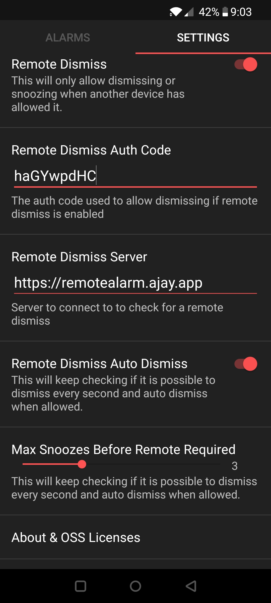

Alarmio Remote
=======

Alarmio Remote is a fork of Alarmio that allows you to require a remote device to allow you to dismiss an alarm. This can help force you to get out of bed by requiring you to go to another phone and click the enable button.

See the [original repo](https://github.com/fennifith/Alarmio) for info about Alarmio itself.

# Features

- Prevent you from dismissing the alarm until you send a request from another device
- Optional: Allow a number of snoozes before you are required to get use the other device to disable the alarm
- Optional: Auto dismiss when when the request from the other device is sent

# Usage

- Download the [latest release](https://github.com/ajayyy/AlarmioRemote/releases/latest)
- Change the auth code option in the options
- Enable "Remote Dismiss" in the options and customise the other options to your choosing
- Setup another device to send a POST request to `https://remotealarm.ajay.app/api/v1/allowAlarmDismiss/[your-auth-code-goes-here]` or your own self-hosted server. This allows dismissing and snoozing for 5 minutes. I have this on an old phone in another room.

- OPTIONAL: Change the server URL in the options with your own self-hosted version of [the server](https://github.com/ajayyy/AlarmioRemoteServer). This is not required and you can use my server if you'd like.

### Advanced options

You can send a POST request to `https://remotealarm.ajay.app/api/v1/allowAlarmDismiss/[your-auth-code-goes-here]/[custom-time-in-minutes]` to set a custom time to allow the alarm to be dismissed.

You can send a POST request to `https://remotealarm.ajay.app/api/v1/denyAlarmDismiss/[your-auth-code-goes-here]` to deny dismissing early.

# Screenshots

</img>

## Permissions

- `SET_ALARM`, `VIBRATE`, `WAKE_LOCK`: uh, this should be obvious
- `ACCESS_COARSE_LOCATION`: determining automatic sunrise/sunset times for "scheduled" light/dark themes
- `INTERNET`: obtaining a set of sunrise/sunset times (location data is not shared outside of the device), as well as fetching graphical assets and some of the information in the about page
- `RECEIVE_BOOT_COMPLETED`: re-schedule alarms on startup
- `READ_EXTERNAL_STORAGE`: used to set custom background / header images in the settings
- `FOREGROUND_SERVICE`: used to notify you to sleep - see the "Sleep Reminder" option in the settings
- `REQUEST_IGNORE_BATTERY_OPTIMIZATIONS`: see [dontkillmyapp.com](https://dontkillmyapp.com/)

## Contributing & Build Instructions

Instructions for contributing to this project and building it locally can be found [here](./.github/CONTRIBUTING.md).
